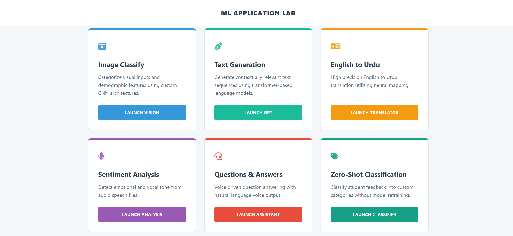

# ML-LAB

**ML LAB** is a comprehensive Flask-based web application that hosts multiple AI and Machine Learning models. It provides services for image classification, text generation, translation, sentiment analysis, question answering, clustering, zero-shot classification, and association rule mining. Users can interact via web forms, upload files, or use voice inputs for real-time AI-powered insights.

---

## Features

### 1. Image Classification 🖼️
- **Model:** Custom CNN  
- **Task:** Binary classification (Male/Female)  
- **Input:** Image file (JPG, PNG, etc.)  
- **Output:** Classification label + confidence score  
- **Launch:** `Launch Vision`

### 2. Text Generation ✨
- **Model:** GPT-2 (Hugging Face Transformers)  
- **Task:** Generate text continuations  
- **Input:** Text prompt  
- **Output:** Generated text  
- **Launch:** `Launch GPT`

### 3. English → Urdu Translation 🌐
- **Model:** Helsinki-NLP OPUS-MT  
- **Task:** Translate English text to Urdu  
- **Input:** English text  
- **Output:** Urdu translation  
- **Launch:** `Launch Translator`

### 4. Sentiment Analysis 😊
- **Model:** RoBERTa-based Transformer  
- **Task:** Analyze sentiment from audio  
- **Input:** Audio file (MP3, WAV, etc.)  
- **Process:** Speech-to-Text → Sentiment Analysis  
- **Output:** Transcribed text + sentiment label + confidence  
- **Launch:** `Launch Analysis`

### 5. Question Answering ❓
- **Model:** DistilBERT QA (SQuAD)  
- **Task:** Voice-driven Q&A  
- **Input:** Audio question  
- **Process:** Speech-to-Text → QA → Text-to-Speech  
- **Output:** Audio answer  
- **Launch:** `Launch Assistant`

### 6. Zero-Shot Classification
- Classify student feedback into custom categories without retraining.  
- **Launch:** `Launch Classifier`

### 7. K-Means Clustering
- Upload datasets and partition into K clusters for pattern discovery.  
- **Launch:** `Launch K-Means`

### 8. DBSCAN Clustering
- Density-based clustering for arbitrary-shaped data patterns.  
- **Launch:** `Launch DBSCAN`

### 9. Apriori Algorithm
- Mine association rules from datasets for relationship discovery.  
- **Launch:** `Launch Apriori`

---

## Installation & Setup

# 1. Clone the repository
git clone https://github.com/yourusername/ml-services-flask.git

# 2. Change into the project directory
cd ml-services-flask

# 3. (Optional but recommended) Create a virtual environment
python -m venv venv

# 4. Activate the virtual environment
# Windows:
venv\Scripts\activate
# Mac/Linux:
source venv/bin/activate

# 5. Upgrade pip
pip install --upgrade pip

# 6. Install dependencies from requirements.txt
pip install -r requirements.txt

# 7. Run the Flask application
python app.py

# 8. Open your browser and navigate to
http://127.0.0.1:5000
